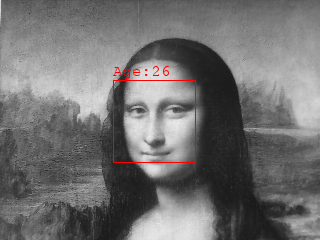
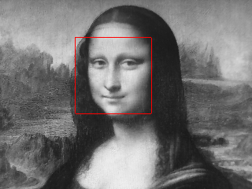
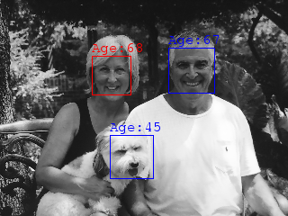
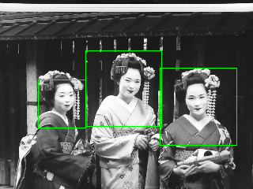
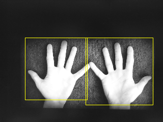

node-omron-hvc-p2
===============

[[Japanese (日本語)](README_ja.md)]

The node-omron-hvc-p2 is a Node.js module which allows you to communicate with the image sensing device "[OMRON Human Vision Components (HVC-P2)](http://www.omron.com/ecb/products/mobile/hvc_p2/)" through a USB serial port.


The [HVC-P2](http://www.omron.com/ecb/products/mobile/hvc_p2/) supports:

* Human Body Detection
* Hand Detection
* Face Detection
* Face Direction Estimation
* Age Estimation
* Gender Estimation
* Gaze Estimation
* Blink Estimation
* Expression Estimation
* Face Recognition

The node-omron-hvc-p2 supports all functions supported by the [HVC-P2](http://www.omron.com/ecb/products/mobile/hvc_p2/). Besides, it allows you to save a camera view image as an image file such as GIF, JPEG, or PNG.

## Dependencies

* [Node.js](https://nodejs.org/en/) 6 +
* [serialport](https://github.com/EmergingTechnologyAdvisors/node-serialport) 5.0.0 +
  * If the serialport module has been already installed in you host computer, check the version. The node-omron-hvc-p2 now does not support older versions of the serialport module than 5.0.0 .
* [node-gd](https://github.com/y-a-v-a/node-gd) (Optional, for Linux, Mac)
* [lwip](https://github.com/EyalAr/lwip) (Optional, for Windows)

## Installation

```
$ cd ~
$ npm install serialport
$ npm install node-omron-hvc-p2
```

The node-omron-hvc-p2 requires an image processing module in order to create images captured by the HVC-P2. For Linux and Mac, the [node-gd](https://github.com/y-a-v-a/node-gd) is required. For Windows, the [lwip](https://github.com/EyalAr/lwip) is required.

If you don't need to get images captured by the HVC-P2, the image processing modules are not required.

### Debian/Ubuntu

It is recommended to install [node-gd](https://github.com/y-a-v-a/node-gd).

```
$ sudo apt-get install libgd2-dev # libgd
$ npm install node-gd
```

### RHEL/CentOS

It is recommended to install [node-gd](https://github.com/y-a-v-a/node-gd).

```
$ sudo yum install gd-devel
$ npm install node-gd
```

### Mac OS

It is recommended to install [node-gd](https://github.com/y-a-v-a/node-gd).

```
$ sudo port install pkgconfig gd2
$ npm install node-gd
```

### Windows

It is recommended to install [lwip](https://github.com/EyalAr/lwip).

```
$ npm install lwip
```

---------------------------------------
## Table of Contents

* [Quick Start](#Quick-Start)
  * [Detecting faces](#Quick-Start-1)
  * [Getting an image](#Quick-Start-2)
* [`HvcP2` object](#HvcP2-object)
  * [connect(*[params]*) method](#HvcP2-connect-method)
  * [disconnect() method](#HvcP2-disconnect-method)
  * [getSerialPortPath() method](#HvcP2-getSerialPortPath-method)
  * [getModelVersion(*[params]*) method](#HvcP2-getModelVersion-method)
  * [detect(*params*) method](#HvcP2-detect-method)
    * [Face detection](#HvcP2-detect-method-face)
    * [Body detection](#HvcP2-detect-method-body)
    * [Hand detection](#HvcP2-detect-method-hand)
  * [getConfigurations(*[params]*) method](#HvcP2-getConfigurations-method)
  * [setConfigurations(*configrations*) method](#HvcP2-setConfigurations-method)
  * [resetConfigurations() method](#HvcP2-resetConfigurations-method)
  * [getFaceRecognitionData(*params*) method](#HvcP2-getFaceRecognitionData-method)
  * [getFaceRecognitionUsers(*[params]*) method](#HvcP2-getFaceRecognitionUsers-method)
  * [addFaceRecognitionData(*params*) method](#HvcP2-addFaceRecognitionData-method)
  * [deleteFaceRecognitionData(*params*) method](#HvcP2-deleteFaceRecognitionData-method)
  * [deleteFaceRecognitionUser(*params*) method](#HvcP2-deleteFaceRecognitionUser-method)
  * [clearFaceRecognitionData() method](#HvcP2-clearFaceRecognitionData-method)
  * [saveAlbum(*params*) method](#HvcP2-saveAlbum-method)
  * [loadAlbum(*params*) method](#HvcP2-loadAlbum-method)
  * [saveAlbumOnFlashROM() method](#HvcP2-saveAlbumOnFlashROM-method)
  * [reformatFlashROM() method](#HvcP2-reformatFlashROM-method)
* [Release Note](#Release-Note)
* [References](#References)
* [License](#License)

---------------------------------------
## <a id="Quick-Start">Quick Start</a>

### <a id="Quick-Start-1">Detecting faces</a>

This sample code shows how to connect to the HVC-P2 and how to send a command to detect faces.

```JavaScript
// Load the node-omron-hvc-p2 and get a `HvcP2` constructor object
const HvcP2 = require('node-omron-hvc-p2');
// Create a `HvcP2` object
const hvcp2 = new HvcP2();

// Connect to the HVC-P2
hvcp2.connect().then(() => {
  // Send a command for detecting
  return hvcp2.detect({
    face   : 1, // Enable face detection
    age    : 1, // Enable age estimation
    gender : 1  // Enable gender Estimation
  });
}).then((res) => {
  // Show the result
  console.log(JSON.stringify(res, null, '  '));
  // Disconnect the HVC-P2
  return hvcp2.disconnect();
}).then(() => {
  console.log('Disconnected.');
}).catch((error) => {
  console.error(error);
});
```

First of all, you have to create a [`HvcP2`](#HvcP2-object) object from the `HvcP2` constructor object. In the code above, the variable `hvcp2` is the [`HvcP2`](#HvcP2-object) object.

Calling the [`connect()`](#HvcP2-connect-method) method, the node-omron-hvc-p2 starts to find a USB serial port which the HVC-P2 is connected, then prepares for use.

Calling the [`detect()`](#HvcP2-detect-method) method, the node-omron-hvc-p2 sends a command to the HVC-P2 in order to detect faces in the camera view. The HVC-P2 supports a lot of detect options. In the code above, Face detection, age estimation, gender estimation are enabled.

The sample code above will output the result as follows:

```
{
  "face": [
    {
      "face": {
        "x": 930,
        "y": 497,
        "size": 390,
        "confidence": 579
      },
      "age": {
        "age": 41,
        "confidence": 500
      },
      "gender": {
        "gender": 1,
        "confidence": 1000
      }
    }
  ]
}
Disconnected.
```

The result says that a face was detected, the age is 41 years old, and the gender is male.

Finally, you can disconnect the device using [`disconnect()`](#HvcP2-disconnect-method) method.

### <a id="Quick-Start-2">Getting an image</a>

The [`detect()`](#HvcP2-detect-method) method can return a image data as well. In the code blow, some parameters related the image option are passed to the method.

```JavaScript
// Load the node-omron-hvc-p2 and get a `HvcP2` constructor object
const HvcP2 = require('node-omron-hvc-p2');
// Create a `HvcP2` object
const hvcp2 = new HvcP2();

// Connect to the HVC-P2
hvcp2.connect().then(() => {
  // Send a command for detecting
  return hvcp2.detect({
    face        : 1,            // Enable face detection
    age         : 1,            // Enable age estimation
    image       : 1,            // Enable capturing image
    imageType   : 3,            // Save the image as a file
    imageFormat : 'png',        // Image format
    imagePath   : './test.png', // File path
    imageMarker : true          // Draw markers in the image
  });
}).then((res) => {
  // Show the result
  console.log(JSON.stringify(res, null, '  '));
  // Disconnect the HVC-P2
  return hvcp2.disconnect();
}).then(() => {
  console.log('Disconnected.');
}).catch((error) => {
  console.error(error);
});
```

The sample code above will output the result as follows:

```
{
  "face": [
    {
      "face": {
        "x": 624,
        "y": 588,
        "size": 330,
        "confidence": 559
      },
      "age": {
        "age": 25,
        "confidence": 666
      }
    }
  ],
  "image": {
    "width": 320,
    "height": 240
  }
}
Disconnected.
```

Besides, an image file will be created in the current directory. If the script is run on Linux or Mac, the image will be like this:



If the detected face was recognized as a woman, the color of markers is red. If recognized as a man, the color is blue.

If the script is run on Windows, the image will be like this:



Note that, as you can see, the age is not supported for Windows.


---------------------------------------
## <a id="HvcP2-object">`HvcP2` object</a>

In order to use the node-omron-hvc-p2, you have to load the node-omron-hvc-p2 module as follows:

```JavaScript
const HvcP2 = require('node-omron-hvc-p2');
```

You can get a `HvcP2` constructor from the code above. Then you have to create an `HvcP2` object from the `HvcP2` constructor as follows:

```JavaScript
const hvcp2 = new HvcP2();
```

In the code snippet above, the variable `hvcp2` is a `HvcP2` object. The `HvcP2` object has methods as described in sections below.

### <a id="HvcP2-connect-method">connect(*[params]*) method</a>

The `connect()` method finds the HVC-P2 connected to a USB port on your host PC, then prepares for use. This method returns a `Promise` object.

```JavaScript
hvcp2.connect().then(() => {
  console.log('Connected.');
  // Do something.
}).catch((error) => {
  console.error(error);
});
```

Basically, you don't need to know which USB serial port your HVC-P2 is connected. This method try to find an appropriate USB serial port. Besides, you don't need to specify the baud rate. This probably works well on at least Debian-based Linux distro (e.g., Raspbian, Ubuntu), Mac, and Windows.

However, the node-omron-hvc-p2 does not necessarily find an appropriate USB serial port. You can specify the USB serial port and the baud rate.

```JavaScript
hvcp2.connect({
  path: 'COM4',
  baudRate: 921600
}).then(() => {
  console.log('Connected.');
  // Do something.
}).catch((error) => {
  console.error(error);
});
```

The `connect()` method takes a hash object as an argument containing properties as follows:

Property   | Required | Type   | Description
:----------|:---------|:-------|:-----------
`path`     | optional | String | The path representing the serial port which your HVC-P2 is connected. (e.g., "COM3", "/dev/ttyACM0", "/dev/tty-usbserial1")
`baudRate` | optional | Number | `9600`, `38400`, `115200`, `230400`, `460800`, or `921600` (Default)

If you want to finish the connection process as soon as possible, you should specify the property `path` because the auto scan mode (no `path` specified) takes a little more time depending on the environment of your host PC.

### <a id="HvcP2-disconnect-method">disconnect() method</a>

The `disconnect()` method releases the connection with your HVC-P2 on the USB port. This method returns a `Promise` object.

```JavaScript
hvcp2.disconnect().then(() => {
  console.log('Disconnected.');
}).catch((error) => {
  console.error(error);
});
```

### <a id="HvcP2-getSerialPortPath-method">getSerialPortPath() method</a>

The `getSerialPortPath()` method returns the path representing the USB serial port assigned to your HVC-P2. Note that this method does not return a `Promise` object unlike other methods.

```JavaScript
hvcp2.connect().then(() => {
  console.log('Serial Port Path: ' + hvcp2.getSerialPortPath());
}).catch((error) => {
  console.error(error);
});
```

The code above will output the result as follows if the code is run on Windows:

```
Serial Port Path: COM4
```

If the code is run on Raspbian, the result will be:

```
Serial Port Path: /dev/ttyACM0
```

Note that this method returns an empty string if any HVC-P2 is not connected using the [`connect()`](#HvcP2-connect-method) method.

### <a id="HvcP2-getModelVersion-method">getModelVersion(*[params]*) method</a>

The `getModelVersion()` method reports the model name and the version number of your HVC-P2. This method returns a `Promise` object. This method takes a hash object as an argument containing properties as follows:

Property | Type    | Required | Description
:--------|:--------|:---------|:------------
`cache`  | Boolean | Optional | `true` (default) or `false`. If `true` is specified or this property is not specified, this method reports the data cached when the `connect()` method was called. If `false` is specified, this method requests to the HVC-P2.

The node-omron-hvc-p2 cashes the model name and version number when the [`connect()`](#HvcP2-connect-method) method is called. This method reports the cashed information by default because the model name and the version number never change. But if you want to make a query again, specify the property `cache` and set it to `false`.

The code blow calls this method and show the cached information.

```JavaScript
hvcp2.getModelVersion().then(() => {
  console.log(JSON.stringify(res, null, '  '));
}).catch((error) => {
  console.error(error);
});
```

The code below calls this method and show the newly queried information.

```JavaScript
hvcp2.getModelVersion({cache: false}).then(() => {
  console.log(JSON.stringify(res, null, '  '));
}).catch((error) => {
  console.error(error);
});
```

The codes above will output the result as follows:

```
{
  "model": "B5T-007001",
  "major": 1,
  "minor": 0,
  "release": 1,
  "revision": 9372
}
```

### <a id="HvcP2-detect-method">detect(*params*) method</a>

The `detect()` method makes your HVC-P2 detect objects in the camera view. This method returns a `Promise` object. This method takes a hash object as an argument containing properties as follows:

Property      | Type    | Required    | Description
:-------------|:--------|:------------|:------------
`body`        | Number  | optional    | Human Body Detection (`0`: disable (default), `1`: enable)
`hand`        | Number  | optional    | Hand Detection (`0`: disable (default), `1`: enable)
`face`        | Number  | optional    | Face Detection (`0`: disable (default), `1`: enable)
`direction`   | Number  | optional    | Face Direction Estimation (`0`: disable (default), `1`: enable)
`age`         | Number  | optional    | Age Estimation (`0`: disable (default), `1`: enable)
`gender`      | Number  | optional    | Gender Estimation (`0`: disable (default), `1`: enable)
`gaze`        | Number  | optional    | Gaze Estimation (`0`: disable (default), `1`: enable)
`blink`       | Number  | optional    | Blink Estimation (`0`: disable (default), `1`: enable)
`expression`  | Number  | optional    | Expression Estimation (`0`: disable (default), `1`: enable)
`recognition` | Number  | optional    | Face Recognition (`0`: disable (default), `1`: enable)
`image`       | Number  | optional    | Image output (`0`: disable (default), `1`: 320x240 pixel, 2: 160x120 pixel)
`imageType`   | Number  | optional    | `0`: Array (default), `1`: Buffer, `2`: Data URL, `3`: File
`imageFormat` | String  | optional    | `"gif"` (default), `"jpg"`, or `"png"`
`imagePath`   | String  | conditional | File path with file name (e.g., `"/tmp/image.png"`)
`imageMarker` | Boolean | optional    | `true` or `false` (default)

Though all properties are optional, at least one among `body`, `hand`, `face`, `direction`, `age`, `gender`, `gaze`, `blink`, `expression`, `recogunition`, and `image` must be set to `1`.

The `imagePath` is required if the `image` is `1` or `2` and the `imageType` is `3` (File).

The result of the detection will be pass to the `resolve()` function, which is a hash object containing the properties as follows:

Property | Type   | Description
:--------|:-------|:-----------
`body`   | Array  | The result of body detection. This property exists only when the request parameter `body` is `1`. Otherwise, this property does not exists. See the section "[Body detection](#HvcP2-detect-method-body)" for details.
`hand`   | Array  | The result of hand detection. This property exists only when the request parameter `hand` is `1`. Otherwise, this property does not exists. See the section "[Hand detection](#HvcP2-detect-method-hand)" for details.
`face`   | Array  | The result of face detection. This property exists only when at least one of request parameters among `face`, `direction`, `age`, `gender`, `gaze`, `blink`, `expression`, and `recognition` is `1`. Otherwise, this property does not exists. See the section "[Face detection](#HvcP2-detect-method-face)" for details.
`image`  | Object | The image data. This property exists only when the request parameter `image` is `1` or `2`. Otherwise, this property does not exists.
+`width` | Number | The width of the image (pixel).
+`height` | Number | The height of the image (pixel).
+`pixels`  | Array  | The pixcel data of the image. This property exists only if the request parameter `imageType` is `0`.
+`buffer`  | Buffer | The Buffer object representing the image. This property exists only if the request parameter `imageType` is `1`.
+`dataUrl` | String | The data URL representing the image. This property exists only if the request parameter `imageType` is `2`.

The pixel data in the `pixels` property represents a gray-scaled image captured by the camera of the HVC-P2. Each element in the Array represents a pixel in the image. The value is an integer between 0 and 255 representing the gray-scale level. The first element in the Array corresponds to the pixel of the top-left corner. The last element in the Array corresponds to the pixel of the bottom-right corner. If the image size is 320x240, the number of the elements in the Array is 76800.

The value of the `buffer` property is a `Buffer` object representing the binary data of the image. The image format depends on the parameter `imageFormat`.

The value of the `dataUrl` property is a data URL of the image like this:

```
data:image/png;base64,iVBORw0KGgoAAAANSU...AElFTkSuQmCC
```

#### <a id="HvcP2-detect-method-face">Face detection</a>

The code below sets all face detection options to '1' (enable) and creates an PNG file with markers in the current directory.

```JavaScript
hvcp2.detect({
    face: 1,
    direction: 1,
    age: 1,
    gender: 1,
    gaze: 1,
    blink: 1,
    expression: 1,
    recognition: 1,
    image: 1,
    imageType: 3,
    imageFormat: 'png',
    imagePath: './capture.png',
    imageMarker: true
  });
}).then((res) => {
  console.log(JSON.stringify(res, null, '  '));
}).catch((error) => {
  console.error(error);
});
```

The image below is the result of the detection. 3 faces are detected (2 human faces and 1 dog face). Note that the HVC-P2 is arranged to detect human faces, not dogs.


([The original picture](https://visualhunt.com/photo/106582/))

The result is as follows:

```JavaScript
{
  "face": [
    {
      "face": {
        "x": 1062,
        "y": 389,
        "size": 252,
        "confidence": 533
      },
      "direction": {
        "yaw": 2,
        "pitch": -15,
        "roll": -2,
        "confidence": 19
      },
      "age": {
        "age": 67,
        "confidence": 333
      },
      "gender": {
        "gender": 1,
        "confidence": 767
      },
      "gaze": {
        "yaw": 3,
        "pitch": -9
      },
      "blink": {
        "left": 432,
        "right": 407
      },
      "expression": {
        "neutral": 1,
        "happiness": 73,
        "surprise": 0,
        "anger": 8,
        "sadness": 18,
        "positive": 47
      },
      "recognition": {
        "user": -127,
        "score": -127
      }
    },
    {
      "face": {
        "x": 728,
        "y": 870,
        "size": 240,
        "confidence": 566
      },
      "direction": {
        "yaw": 6,
        "pitch": -13,
        "roll": -12,
        "confidence": 1
      },
      "age": {
        "age": 45,
        "confidence": 153
      },
      "gender": {
        "gender": 1,
        "confidence": 713
      },
      "gaze": {
        "yaw": -4,
        "pitch": 3
      },
      "blink": {
        "left": 418,
        "right": 465
      },
      "expression": {
        "neutral": 44,
        "happiness": 1,
        "surprise": 15,
        "anger": 39,
        "sadness": 1,
        "positive": -50
      },
      "recognition": {
        "user": -127,
        "score": -127
      }
    },
    {
      "face": {
        "x": 618,
        "y": 417,
        "size": 216,
        "confidence": 671
      },
      "direction": {
        "yaw": 3,
        "pitch": -20,
        "roll": 1,
        "confidence": 1
      },
      "age": {
        "age": 68,
        "confidence": 400
      },
      "gender": {
        "gender": 0,
        "confidence": 538
      },
      "gaze": {
        "yaw": 4,
        "pitch": -2
      },
      "blink": {
        "left": 366,
        "right": 455
      },
      "expression": {
        "neutral": 0,
        "happiness": 100,
        "surprise": 0,
        "anger": 0,
        "sadness": 0,
        "positive": 100
      },
      "recognition": {
        "user": -127,
        "score": -127
      }
    }
  ],
  "image": {
    "width": 320,
    "height": 240
  }
}
```

The meanings of the properties above is as follows:

Property       | Type   | Description
:--------------|:-------|:-----------
`face`         | Object | The result of the face detection.
+`x`          | Number | The x-coordinate of the center point of the detected face in the camera view port (1920 x 1080)
+`y`          | Number | The y-coordinate of the center point of the detected face in the camera view port (1920 x 1080)
+`size`       | Number | The size of the square representing the detected face.
+`confidence` | Number | The confidence in the face detection (0 - 1000).
`direction`    | Object | The result of the face direction estimation.
+`yaw`        | Number | The yaw angle of the detected face. The unit is degree. If the face looks to the left, this value is positive. If the face looks to the right, this value is negative.
+`pitch`      | Number | The pitch angle of the detected face. The unit is degree. If the face looks to the top, this value is positive. If the face looks to the bottom, this value is negative.
+`roll`       | Number | The roll angle of the detected face. The unit is degree. If the face leans to the left, this value is positive. If the face leans to the right, the value is negative.
+`confidence` | Number | The confidence in the face direction estimation (0 - 1000).
`age`          | Object | The result of the age estimation.
+`age`        | Number | The age estimated from the detected face. The maximum value is 75.
+`confidence` | Number | The confidence in the age estimation (0 - 1000).
`gender`       | Object | The result of the gender estimation.
+`gender`     | Number | The gender estimated from the detected face. If the value is `0`, it means female. If the value is `1`, it means male.
+`confidence` | Number | The confidence in the gender estimation (0 - 1000).
`gaze`         | Object | The result of the gaze estimation.
+`yaw`        | Number | The yaw angle of the gaze of the detected face. The unit is degree. If the eyes on the detected face look to the left, this value is positive. If the eyes on the detected face look to the right, this value is negative.
+`pitch`      | Number | The pitch angle of the gaze of the detected face. The unit is degree. If the eyes on the detected face look to the top, this value is positive. If the eyes on the detected face look to the bottom, this value is negative.
`blink`        | Object | The result of the blink estimation.
+`left`       | Number | The blink degree of the left eye on the detected face. If the eye is fully opened, this value is 1. If the eye is fully shut, this value is 1000.
+`right`      | Number | The blink degree of the right eye on the detected face. If the eye is fully opened, this value is 1. If the eye is fully shut, this value is 1000.
`expression`   | Object | The result of the expression estimation.
+`neutral`    | Number | The degree of the neutral estimated from the detected face. The range of value is from 0 to 100.
+`happiness`  | Number | The degree of the happiness estimated from the detected face. The range of value is from 0 to 100.
+`surprise`   | Number | The degree of the surprise estimated from the detected face. The range of value is from 0 to 100.
+`anger`      | Number | The degree of the anger estimated from the detected face. The range of value is from 0 to 100.
+`sadness`    | Number | The degree of the sadness estimated from the detected face. The range of value is from 0 to 100.
+`positive`   | Number | The degree of the positiveness estimated from the detected face. The range of value is from -100 to 100. If the value is positive, the detected face looks like happy. If the value is negative, the detected face looks like sad or angry.
`recognition`  | Object | The result of the face recognition.
+`userId`       | Number | The user ID recognized from the detected face. If no user is recognized, this value will be -127.
+`score`      | Number | The score of the recognition. The range of the value is from 0 to 1000. If no user is recognized, this value will be -127.

#### <a id="HvcP2-detect-method-body">Body detection</a>

The code below sets the body detection option to '1' (enable) and creates an PNG file with markers in the current directory.

```JavaScript
hvcp2.detect({
    body: 1,
    image: 1,
    imageType: 3,
    imageFormat: 'png',
    imagePath: './capture.png',
    imageMarker: true
  });
}).then((res) => {
  console.log(JSON.stringify(res, null, '  '));
}).catch((error) => {
  console.error(error);
});
```

The image below is the result of the detection. 3 bodies are detected.


([The original picture](https://visualhunt.com/photo/68310/))

The result is as follows:

```
{
  "body": [
    {
      "x": 1252,
      "y": 674,
      "size": 488,
      "confidence": 889
    },
    {
      "x": 780,
      "y": 560,
      "size": 480,
      "confidence": 552
    },
    {
      "x": 390,
      "y": 656,
      "size": 304,
      "confidence": 642
    }
  ],
  "image": {
    "width": 320,
    "height": 240
  }
}

```

The meanings of the properties above is as follows:

Property     | Type   | Description
:------------|:-------|:-----------
`x`          | Number | The x-coordinate of the center point of the detected body in the camera view port (1920 x 1080)
`y`          | Number | The y-coordinate of the center point of the detected body in the camera view port (1920 x 1080)
`size`       | Number | The size of the square representing the detected body.
`confidence` | Number | The confidence in the body detection (0 - 1000).

#### <a id="HvcP2-detect-method-hand">Hand detection</a>

The code below sets the hand detection option to '1' (enable) and creates an PNG file with markers in the current directory.

```JavaScript
hvcp2.detect({
    hand: 1,
    image: 1,
    imageType: 3,
    imageFormat: 'png',
    imagePath: './capture.png',
    imageMarker: true
  });
}).then((res) => {
  console.log(JSON.stringify(res, null, '  '));
}).catch((error) => {
  console.error(error);
});
```

The image below is the result of the detection. 2 hands are detected.


([The original picture](https://visualhunt.com/f/photo/8197817878/c0ba443eb0/))

The result is as follows:

```JavaScript
{
  "hand": [
    {
      "x": 1168,
      "y": 699,
      "size": 661,
      "confidence": 1000
    },
    {
      "x": 550,
      "y": 675,
      "size": 608,
      "confidence": 972
    }
  ],
  "image": {
    "width": 320,
    "height": 240
  }
}
```

The meanings of the properties above is as follows:

Property     | Type   | Description
:------------|:-------|:-----------
`x`          | Number | The x-coordinate of the center point of the detected hand in the camera view port (1920 x 1080)
`y`          | Number | The y-coordinate of the center point of the detected hand in the camera view port (1920 x 1080)
`size`       | Number | The size of the square representing the detected hand.
`confidence` | Number | The confidence in the hand detection (0 - 1000).

### <a id="HvcP2-getConfigurations-method">getConfigurations(*[params]*) method</a>

The `getConfigurations()` method reports the configurations of your HVC-P2. This method returns a `Promise` object. This method takes a hash object as an argument containing properties as follows:

Property | Type    | Required | Description
:--------|:--------|:---------|:------------
`cache`  | Boolean | Optional | `true` (default) or `false`. If `true` is specified or this property is not specified, this method reports the data cached when the `connect()` method was called. If `false` is specified, this method requests to the HVC-P2.

The node-omron-hvc-p2 cashes the configurations when the [`connect()`](#HvcP2-connect-method) method is called. This method reports the cashed configurations by default. If you want to make a query again, specify the `cache` property and set it to `false`.

The code blow calls this method and show the cached configurations.

```JavaScript
hvcp2.getConfigurations().then((res) => {
  console.log(JSON.stringify(res, null, '  '));
}).catch((error) => {
  console.error(error);
});
```

The code below calls this method and show the newly queried configurations.

```JavaScript
hvcp2.getConfigurations({cache: false}).then((res) => {
  console.log(JSON.stringify(res, null, '  '));
}).catch((error) => {
  console.error(error);
});
```

The codes above will output the result as follows:

```JavaScript
{
  "cameraAngle": {
    "angle": 0
  },
  "threshold": {
    "body": 500,
    "hand": 500,
    "face": 500,
    "recognition": 500
  },
  "detectionSize": {
    "bodyMin": 30,
    "bodyMax": 8192,
    "handMin": 40,
    "handMax": 8192,
    "faceMin": 64,
    "faceMax": 8192
  },
  "faceAngle": {
    "yaw": 0,
    "roll": 0
  }
}
```

The meanings of the properties above are described in the next section "[`setConfigurations()` method](#HvcP2-setConfigurations-method)".

### <a id="HvcP2-setConfigurations-method">setConfigurations(*configrations*) method</a>

The `setConfigurations()` method sets the configurations. This method returns a `Promise` object. This method takes a hash object as an argument containing properties as follows:

Property        | Type   | Required | Description
:---------------|:-------|:---------|:------------
`cameraAngle`   | Object | optional | Camera Angle
+`angle`        | Number | optional | 0: 0º, 1: 90º, 2: 180º, 3: 270º
`threshold`     | Object | optional | Threshold Values
+`body`         | Number | optional | Human Body Detection threshold (1 - 1000)
+`hand`         | Number | optional | Hand Detection threshold (1 - 1000)
+`face`         | Number | optional | Face Detection threshold (1 - 1000)
+`recognition`  | Number | optional | Face Recognition threshold (0 - 1000)
`detectionSize` | Object | optional | Detection Size
+`bodyMin`      | Number | optional | Human Body Detection minimum size (20 - 8192)
+`bodyMax`      | Number | optional | Human Body Detection maximum size (20 - 8192)
+`handMin`      | Number | optional | Hand Detection minimum size (20 - 8192)
+`handMax`      | Number | optional | Hand Detection maximum size (20 - 8192)
+`faceMin`      | Number | optional | Face Detection minimum size (20 - 8192)
+`faceMax`      | Number | optional | Face Detection maximum size (20 - 8192)
`faceAngle`     | Object | optional | Face Angle Range
+`yaw`          | Number | optional | Yaw angle range (0: ±30º, 1: ±60º, 2: ±90º)
+`roll`         | Number | optional | Roll angle range (0: ±15º, 1: ±45º)

Though all properties are optional, at least one property must be specified.

See the "[Human Vision Components (HVC-P2) B5T-007001 Command Manual (PDF)](http://www.omron.com/ecb/products/mobile/hvc_p2/file/B5T-007001_CommandSpecifications_A.pdf)" for the details of the configurations.

The updated configurations will be pass to the `resolve()` function, which is a hash object containing the all properties as same as the properties described above.

The code below set the camera angle to 270º.

```JavaScript
hvcp2.setConfigurations({
  cameraAngle: {
    angle: 3 // Camera angle: 270º
  }
}).then((res) => {
  console.log(JSON.stringify(res, null, '  '));
}).catch((error) => {
  console.error(error);
});
```

The code above will output the result as follows:

```JavaScript
{
  "cameraAngle": {
    "angle": 3
  },
  "threshold": {
    "body": 500,
    "hand": 500,
    "face": 500,
    "recognition": 500
  },
  "detectionSize": {
    "bodyMin": 30,
    "bodyMax": 8192,
    "handMin": 40,
    "handMax": 8192,
    "faceMin": 64,
    "faceMax": 8192
  },
  "faceAngle": {
    "yaw": 0,
    "roll": 0
  }
}
```

### <a id="HvcP2-resetConfigurations-method">resetConfigurations() method</a>

The `resetConfigurations()` method restore the default settings. This method returns a `Promise` object.

The updated configurations will be pass to the `resolve()` function, which is a hash object containing the all properties as same as the properties described above.

```JavaScript
hvcp2.resetConfigurations().then((res) => {
  console.log(JSON.stringify(res, null, '  '));
}).catch((error) => {
  console.error(error);
});
```
The code above will output the result as follows:

```JavaScript
{
  "cameraAngle": {
    "angle": 0
  },
  "threshold": {
    "body": 500,
    "hand": 500,
    "face": 500,
    "recognition": 500
  },
  "detectionSize": {
    "bodyMin": 30,
    "bodyMax": 8192,
    "handMin": 40,
    "handMax": 8192,
    "faceMin": 64,
    "faceMax": 8192
  },
  "faceAngle": {
    "yaw": 0,
    "roll": 0
  }
}
```

### <a id="HvcP2-getFaceRecognitionUsers-method">getFaceRecognitionUsers(*[params]*) method</a>

The `getFaceRecognitionUsers()` method reports a list of the user ID registered in the album. This method returns a `Promise` object. This method takes a hash object as an argument containing properties as :

Property | Type    | Required | Description
:--------|:--------|:---------|:------------
`cache`  | Boolean | Optional | `true` (default) or `false`. If `true` is specified or this property is not specified, this method reports the data cached when the `connect()` method was called. If `false` is specified, this method requests to the HVC-P2.

The node-omron-hvc-p2 cashes the user ID registered in the album when the [`connect()`](#HvcP2-connect-method) method is called. This method reports the cashed list. But if you want to make a query again, specify the `cache` property and set it to `false`.

The result will be pass to the `resolve()` function, which is a hash object containing the properties as follows:

Property     | Type  | Description
:------------|:------|:-----------
`userIdList` | Array | The list containing the user IDs registered in the album.

The code blow calls this method and show the cached information.

```JavaScript
hvcp2.getFaceRecognitionUsers().then((res) => {
  console.log(JSON.stringify(res, null, '  '));
}).catch((error) => {
  console.error(error);
});
```

The code below calls this method and show the newly queried information.

```JavaScript
hvcp2.getFaceRecognitionUsers({cache: true}).then((res) => {
  console.log(JSON.stringify(res, null, '  '));
}).catch((error) => {
  console.error(error);
});
```

The codes above will output the result as follows:

```
{
  "userIdList": [
    1,
    3
  ]
}
```

### <a id="HvcP2-getFaceRecognitionData-method">getFaceRecognitionData(*params*) method</a>

The `getFaceRecognitionData()` method reports a list of the data ID associated with the specified user ID. This method returns a `Promise` object. This method takes a hash object as an argument containing properties as follows:

Property      | Type   | Required    | Description
:-------------|:-------|:------------|:------------
`userId`      | Number | required    | The user ID. The value must be an integer between `0` and `99`.

If no data associated with the specified `userId` is registered in the HVC-P2, the `reject()` function will be called.

The code below get a list of data ID associated with the user ID `1`.

```JavaScript
hvcp2.getFaceRecognitionData({
  userId: 1
}).then((res) => {
  console.log(JSON.stringify(res, null, '  '));
}).catch((error) => {
  console.error(error);
});
```

The code above will output the result as follows:

```JavaScript
{
  "dataIdList": [
    2
  ]
}
```

### <a id="HvcP2-addFaceRecognitionData-method">addFaceRecognitionData(*params*) method</a>

The `addFaceRecognitionData()` method adds a face recognition data to the album in the HVC-P2. This method returns a `Promise` object. This method takes a hash object as an argument containing properties as follows:

Property      | Type   | Required    | Description
:-------------|:-------|:------------|:------------
`userId`      | Number | required    | The user ID. The value must be an integer between `0` and `99`.
`dataId`      | Number | required    | The data ID. The value must be an integer between `0` and `9`.
`imageType`   | Number | optional    | `0`: Array (default), `1`: Buffer, `2`: Data URL, `3`: File
`imageFormat` | String | optional    | `"gif"` (default), `"jpg"`, or `"png"`
`imagePath`   | String | conditional | File path with file name (e.g., `"/tmp/image.png"`)

If a face is recognized, the result will be pass to the `resolve()` function, which is a hash object containing the properties as follows:

Property  | Type   | Description
:---------|:-------|:-----------
`width`   | Number | The width of the registered face image. The value is always `64`.
`height`  | Number | The height of the registered face image. The value is always `64`.
`pixels`  | Array  | The pixel data of the recognized face. This property exists only if the parameter `imageType` is `0`.
`buffer`  | Buffer | The Buffer object representing the recognized face image. This property exists only if the parameter `imageType` is `1`.
`dataUrl` | String | The data URL representing the recognized face image. This property exists only if the parameter `imageType` is `2`.

Note that the target face has to be in the scope of the camera when this method is executed. If no face is recognized or 2 or more faces are recognized, the `reject()` function will be called.

The code below adds a user with user ID `1` and data ID `2` and save the recognized face image as a file `"face.png"`.

```JavaScript
hvcp2.addFaceRecognitionData({
  userId: 1,
  dataId: 2,
  imageType: 3,
  imageFormat: 'png',
  imagePath: 'face.png'
}).then((res) => {
  console.dir(res);
}).catch((error) => {
  console.error(error);
});
```

The code above will output the result as follows:

```JavaScript
{ width: 64, height: 64 }
```

The created PNG file is as follows:


([The original picture](https://visualhunt.com/photo/106582/))

In order to accurize the face recognition, it is recommended to call this method some times for a face. The HVC-P2 can register up to 9 data per user.

After adding face recognition data, try the [`detect()`](#HvcP2-detect-method) method with the parameter `recognition` as follows:

```JavaScript
hvcp2.detect({
  recognition: 1,
}).then((res) => {
  console.log(JSON.stringify(res, null, '  '));
}).catch((error) => {
  console.error(error);
});
```

If the registered user face is recognized, the result will be as follows:

```JavaScript
{
  "face": [
    {
      "recognition": {
        "userId": 1,
        "score": 988
      }
    }
  ]
}
```

### <a id="HvcP2-deleteFaceRecognitionData-method">deleteFaceRecognitionData(*params*) method</a>

The `deleteFaceRecognitionData()` method deletes a face recognition data from the album in the HVC-P2. This method returns a `Promise` object. This method takes a hash object as an argument containing properties as follows:

Property      | Type   | Required    | Description
:-------------|:-------|:------------|:------------
`userId`      | Number | required    | The user ID. The value must be an integer between `0` and `99`.
`dataId`      | Number | required    | The data ID. The value must be an integer between `0` and `9`.

If no data corresponding to the specified `userId` and `dataId` is registered in the album, the `reject()` function will be called.

The code below deletes a face recognition data corresponding to the user ID `1` and the data ID `2`.

```JavaScript
hvcp2.deleteFaceRecognitionData({
  userId: 1,
  dataId: 2
}).then(() => {
  console.log('Deleted.');
}).catch((error) => {
  console.error(error);
});
```

### <a id="HvcP2-deleteFaceRecognitionUser-method">deleteFaceRecognitionUser(*params*) method</a>

The `deleteFaceRecognitionUser()` method deletes all face recognition data associated with the specified user ID in the album. This method returns a `Promise` object. This method takes a hash object as an argument containing properties as follows:

Property      | Type   | Required    | Description
:-------------|:-------|:------------|:------------
`userId`      | Number | required    | The user ID. The value must be an integer between `0` and `99`.

If no data associated with the specified `userId` is registered in the album, the `reject()` function will be called.

The code below deletes all face recognition data associated with the user ID `1`.

```JavaScript
hvcp2.deleteFaceRecognitionUser({
  userId: 1
}).then(() => {
  console.log('Deleted.');
}).catch((error) => {
  console.error(error);
});
```

### <a id="HvcP2-clearFaceRecognitionData-method">clearFaceRecognitionData() method</a>

The `clearFaceRecognitionData()` method deletes all face recognition data in the album. This method returns a `Promise` object.

```JavaScript
hvcp2.clearFaceRecognitionData().then(() => {
  console.log('Deleted.');
}).catch((error) => {
  console.error(error);
});
```

### <a id="HvcP2-saveAlbum-method">saveAlbum(*params*) method</a>

The `saveAlbum()` method reports the album data set in the HVC-P2. It also can save the album data as a binary file. This method returns a `Promise` object. This method takes a hash object as an argument containing properties as follow:

Property | Type   | Required | Description
:--------|:-------|:---------|:------------
`path`   | String | optional | File path with the file name.

If the `path` property is specified, this method will create a album file.

The result will be pass to the `resolve()` function, which is a hash object containing the properties as follows:

Property | Type   | Description
:--------|:-------|:-----------
`album`  | Buffer | A Buffer object representing the album data.

The code below saves the album data as a file `"HVCAlbum.hac"` in the current directory.

```JavaScript
hvcp2.saveAlbum({
  path: 'HVCAlbum.hac'
}).then((res) => {
  console.log(res);
}).catch((error) => {
  console.error(error);
});
```

The code above will output the result as follows:

```JavaScript
{ album: <Buffer 20 00 ...> }
```

The `album` property, whether or not the parameter `path` was passed to the `saveAlbum()` method,  will be set.

### <a id="HvcP2-loadAlbum-method">loadAlbum(*params*) method</a>

The `loadAlbum()` method load the album data to the HVC-P2. This method returns a `Promise` object. This method takes a hash object as an argument containing properties as follows:

Property | Type   | Required | Description
:--------|:-------|:---------|:------------
`buffer` | Buffer | optional | A Buffer object representing the album data.
`path`   | String | optional | A File path of the album data.

Though both the `buffer` and `path` are optional, one or the other must be specified.

The code below loads the album data saved in a album file `"HVCAlbum.hac"` which was saved by the `saveAlbum()` method.

```JavaScript
hvcp2.loadAlbum({
  path: 'HVCAlbum.hac'
}).then(() => {
  console.log('Loaded.');
}).catch((error) => {
  console.error(error);
});
```

### <a id="HvcP2-saveAlbumOnFlashROM-method">saveAlbumOnFlashROM() method</a>

The album data is saved in the volatile memory. Therefore, the album data will be gone if the HVC-P2 is turned off. If you want to save the album data permanently (that is, save in the non-volatile memory), you can use the `saveAlbumOnFlashROM()` method. This method returns a `Promise` object.

```JavaScript
hvcp2.saveAlbumOnFlashROM();
}).then(() => {
  console.log('Saved.');
}).catch((error) => {
  console.error(error);
});
```

### <a id="HvcP2-reformatFlashROM-method">reformatFlashROM() method</a>

The `reformatFlashROM()` method formats the non-volatile memory in the HVC-P2. This method returns a `Promise` object.

```JavaScript
hvcp2.reformatFlashROM();
}).then(() => {
  console.log('Saved.');
}).catch((error) => {
  console.error(error);
});
```

---------------------------------------
## <a id="Release-Note">Release Note</a>

* v0.1.1 (2017-09-23)
  * Fixed a bug that an error was thrown when no device was found depending on a condition.
* v0.1.0 (2017-08-06)
  * The auto detection of a USB serial port was Improved with more efficient way.
* v0.0.1 (2017-06-24)
  * First public release

---------------------------------------
## <a id="References">References</a>

* [OMRON B5T-007001 Human Vision Components (HVC-P2)](http://www.omron.com/ecb/products/mobile/hvc_p2/)
* [Human Vision Components (HVC-P2) B5T-007001 Command Manual (PDF)](http://www.omron.com/ecb/products/mobile/hvc_p2/file/B5T-007001_CommandSpecifications_A.pdf)
* [OMRON's Image Sensing Technology - OKAO&trade; Vision](https://plus-sensing.omron.com/technology/)
* [OMRON SENSING EGG PROJECT](https://plus-sensing.omron.com/egg-project/)

---------------------------------------
## <a id="License">License</a>

The MIT License (MIT)

Copyright (c) 2017 Futomi Hatano

Permission is hereby granted, free of charge, to any person obtaining a copy
of this software and associated documentation files (the "Software"), to deal
in the Software without restriction, including without limitation the rights
to use, copy, modify, merge, publish, distribute, sublicense, and/or sell
copies of the Software, and to permit persons to whom the Software is
furnished to do so, subject to the following conditions:

The above copyright notice and this permission notice shall be included in all
copies or substantial portions of the Software.

THE SOFTWARE IS PROVIDED "AS IS", WITHOUT WARRANTY OF ANY KIND, EXPRESS OR
IMPLIED, INCLUDING BUT NOT LIMITED TO THE WARRANTIES OF MERCHANTABILITY,
FITNESS FOR A PARTICULAR PURPOSE AND NONINFRINGEMENT. IN NO EVENT SHALL THE
AUTHORS OR COPYRIGHT HOLDERS BE LIABLE FOR ANY CLAIM, DAMAGES OR OTHER
LIABILITY, WHETHER IN AN ACTION OF CONTRACT, TORT OR OTHERWISE, ARISING FROM,
OUT OF OR IN CONNECTION WITH THE SOFTWARE OR THE USE OR OTHER DEALINGS IN THE
SOFTWARE.
